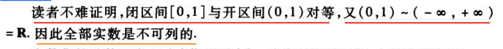

## Contributions on Github

<!-- https://github.com/anuraghazra/github-readme-stats -->

<!-- https://github.com/DenverCoder1/github-readme-streak-stats -->

  

  

  

## What I am trying to do

  1. <b>Mathematics Notes</b> based on Latex
  2. Projects related to C++
  3. Projects related to Python

## Why I want to do all the above

  ### Mathematics Notes with Latex

  - A lot of ``<b>Readers have no trouble proving……</b>'', but the actual truth is……
  - The corresponding companion answer sets for the exercises are <b>not that detailed</b>

  <table width="100%" style="table-layout: fixed;">
    <tr>
      <td align="center" style="width: 50%;">
        
        
Arrogance

      </td>
      <td align="center" style="width: 50%;">
        
        
Not that Specific

      </td>
    </tr>
  </table>

## Languages 

  

## Tools

  

## Contact with me

<!--

  
-->

